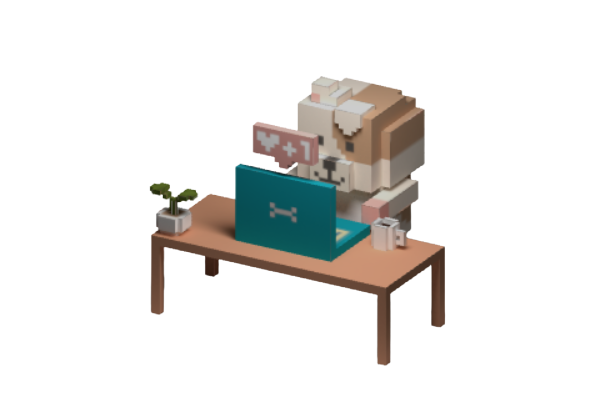

<p align="center">
    
    <br>
    <span style="font-weight: bold;">This dog was made by the great master Takuya Matsuyama (松山拓也), who I admire</span>
</p>

<h1 align="center">Personal Portfolio</h1>

## Introduction
Ever since I started my programming journey, I've been captivated by the power of the internet and the ability to share my knowledge and experiences with people around the world. Inspired by the incredible work of the esteemed master <a href='https://github.com/craftzdog/craftzdog-homepage'>Takuya Matsuyama (松山拓也)</a>, I embarked on creating my own personal portfolio to showcase my skills and personality.

## Project Overview
This project aims to create a visually stunning and informative personal portfolio that not only highlights my expertise and projects but also reflects my unique identity. I strive to create a portfolio that engages visitors and provides them with a comprehensive understanding of who I am as a professional.

## Key Features
- **Captivating Visual Design**: The portfolio will feature a captivating visual design, incorporating harmonious colors, elegant typography, and visually appealing elements. The goal is to create an immersive experience that leaves a lasting impression on visitors.

- **Seamless User Experience**: Prioritizing a user-centered approach, the portfolio will ensure effortless navigation and access to desired information. Intuitive interfaces and interactive elements will enhance the overall user experience.

- **Skills and Projects Showcase**: A dedicated section will showcase my technical skills. I will also highlight my past projects (also those in development), and job experience.

- **About Me**: A comprehensive "About Me" section will allow visitors to delve into my background, experiences, and the driving forces behind my passion for programming. This section will foster a personal connection and provide insight into my professional journey.
## Stack

- [Next.js](https://nextjs.org/) - A React framework with hybrid static & server rendering, and route pre-fetching, etc.
- [Chakra UI](https://chakra-ui.com/) - A simple, modular and accessible component library for React
- [Three.js](https://threejs.org/) - 3D library for JavaScript
- [Framer Motion](https://www.framer.com/motion/) - An animation library for React

## Project structure

```
$PROJECT_ROOT
│   # Page files
├── pages
│   # React component files
├── components
│   # Non-react modules
├── lib
│   # Static files for images and 3d model file
└── public
```
## Installation
1. Clone the repository: `git clone https://github.com/RodolfoMRibeiro/portfolio.git`
2. Install the necessary dependencies: `npm install`
3. Customize the portfolio with your own content and images.
4. Build the project: `npm run build`
5. Deploy the portfolio to a web server of your choice.

## Usage
1. Access the portfolio by opening the `index.html` file in your preferred web browser.
2. Explore the various sections to learn more about my skills, projects, and experiences.
3. Contact me using the provided methods if you have any inquiries or opportunities.

## Contributing
Contributions are welcome! If you find any issues or have suggestions for improvements, feel free to submit a pull request.

## License
This project is licensed under the [MIT License](LICENSE).

---

Created with ❤️ by [Rodolfo Marques Ribeiro](https://portfolio-chi-five-21.vercel.app/)
